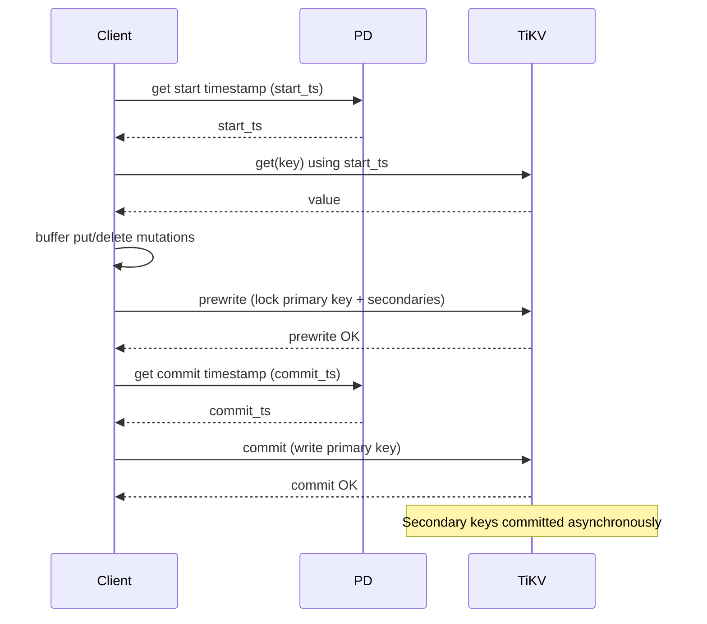

## Overview

The Transactional KV API provides ACID-compliant transactions built on TiKV's MVCC (Multi-Version Concurrency Control) layer. Transactions follow the [Percolator](https://research.google/pubs/large-scale-incremental-processing-using-distributed-transactions-and-notifications/) model from Google, adapted with performance improvements for distributed key-value workloads.

Every transaction has a unique `start_ts` (start timestamp) assigned by the Placement Driver (PD). All reads in the transaction use this timestamp to provide a consistent snapshot. Writes are buffered locally and committed atomically using 2-phase commit (2PC).

Use Transactional KV when:

- Multiple keys must be written atomically (all-or-nothing)
- You need repeatable reads within a single operation
- You need conflict detection: the commit fails if another transaction modified a key you read
- You are building on top of a relational layer (like TiDB)

<Warning>
Do not mix Transactional KV and Raw KV operations on the same key space. The encodings are incompatible and data corruption will result.
</Warning>

## Transaction lifecycle



<Steps>
  <Step title="Begin">
    The client obtains a `start_ts` from PD. This timestamp defines the snapshot for all reads in the transaction.
  </Step>
  <Step title="Read and write">
    Issue `get`, `batch_get`, and `scan` calls to read data at `start_ts`. Call `put` and `delete` to buffer mutations locally.
  </Step>
  <Step title="Prewrite">
    The client sends all buffered mutations to TiKV. TiKV writes a lock record for the primary key and all secondary keys. If any key is already locked, prewrite fails and the client must retry or back off.
  </Step>
  <Step title="Commit">
    The client fetches a `commit_ts` from PD, then commits the primary key. Once the primary is committed, secondary locks are resolved asynchronously in the background.
  </Step>
  <Step title="Rollback (on failure)">
    If prewrite fails or the client abandons the transaction, it sends a rollback to release all locks.
  </Step>
</Steps>

## Core operations

### begin

Start a new transaction and obtain a `start_ts` from PD.

**Returns:** A transaction object. All subsequent operations are called on this object.

<Tabs>
  <Tab title="Python">

```python
from tikv_client import TransactionClient

client = TransactionClient.connect(["127.0.0.1:2379"])
txn = client.begin()
```

  </Tab>
  <Tab title="Go">

```go
import "github.com/tikv/client-go/v2/txnkv"

client, err := txnkv.NewClient([]string{"127.0.0.1:2379"})
if err != nil {
    log.Fatal(err)
}

txn, err := client.Begin()
if err != nil {
    log.Fatal(err)
}
```

  </Tab>
</Tabs>

---

### get

Read the value of a key as of the transaction's `start_ts`. If the key has been written in the current transaction (but not yet committed), the buffered value is returned (read-your-writes).

<ParamField path="body.key" type="bytes" required>
  The key to read.
</ParamField>

**Returns:** The value as bytes, or `None` if the key does not exist at `start_ts`.

<Tabs>
  <Tab title="Python">

```python
txn = client.begin()
value = txn.get(b'account:alice')
```

  </Tab>
  <Tab title="Go">

```go
txn, _ := client.Begin()
value, err := txn.Get(context.Background(), []byte("account:alice"))
```

  </Tab>
</Tabs>

---

### put

Buffer a write mutation. The write is not sent to TiKV until `commit()` is called.

<ParamField path="body.key" type="bytes" required>
  The key to write.
</ParamField>

<ParamField path="body.value" type="bytes" required>
  The value to store.
</ParamField>

<Tabs>
  <Tab title="Python">

```python
txn.put(b'account:alice', b'1000')
```

  </Tab>
  <Tab title="Go">

```go
err := txn.Set([]byte("account:alice"), []byte("1000"))
```

  </Tab>
</Tabs>

---

### delete

Buffer a delete mutation. The key is not removed from TiKV until `commit()` is called.

<ParamField path="body.key" type="bytes" required>
  The key to delete.
</ParamField>

<Tabs>
  <Tab title="Python">

```python
txn.delete(b'session:expired')
```

  </Tab>
  <Tab title="Go">

```go
err := txn.Delete([]byte("session:expired"))
```

  </Tab>
</Tabs>

---

### scan

Scan key-value pairs in a range as of `start_ts`.

<ParamField path="body.start" type="bytes" required>
  Start of the scan range (inclusive).
</ParamField>

<ParamField path="body.end" type="bytes">
  End of the scan range (exclusive). Omit for an open-ended scan.
</ParamField>

<ParamField path="body.limit" type="number" required>
  Maximum number of key-value pairs to return.
</ParamField>

<Tabs>
  <Tab title="Python">

```python
txn = client.begin()
results = txn.scan(b'order:', b'order;', 100)
for key, value in results:
    print(key, value)
```

  </Tab>
  <Tab title="Go">

```go
txn, _ := client.Begin()
iter, err := txn.Iter([]byte("order:"), []byte("order;"))
for iter.Valid() {
    fmt.Println(iter.Key(), iter.Value())
    iter.Next()
}
iter.Close()
```

  </Tab>
</Tabs>

---

### commit

Commit all buffered mutations atomically. Internally, this performs:

1. **Prewrite** — write locks for all mutations to TiKV
2. **Get commit_ts** — fetch a commit timestamp from PD
3. **Commit** — write the primary key's commit record; secondaries resolve asynchronously

**Returns:** The `commit_ts` on success.

**Raises:** A conflict error if another transaction has committed a write to any key since `start_ts`.

<Tabs>
  <Tab title="Python">

```python
txn = client.begin()
txn.put(b'counter', b'42')
txn.commit()
```

  </Tab>
  <Tab title="Go">

```go
txn, _ := client.Begin()
txn.Set([]byte("counter"), []byte("42"))
err := txn.Commit(context.Background())
```

  </Tab>
</Tabs>

---

### rollback

Abort the transaction and release all locks. Call this if you catch an error during prewrite or if the application logic decides to cancel.

<Tabs>
  <Tab title="Python">

```python
txn = client.begin()
try:
    txn.put(b'key', b'value')
    txn.commit()
except Exception as e:
    txn.rollback()
    raise
```

  </Tab>
  <Tab title="Go">

```go
txn, _ := client.Begin()
txn.Set([]byte("key"), []byte("value"))
if err := txn.Commit(ctx); err != nil {
    txn.Rollback()
}
```

  </Tab>
</Tabs>

## Complete transaction example

This example performs an atomic balance transfer between two accounts:

<Tabs>
  <Tab title="Python">

```python
from tikv_client import TransactionClient

client = TransactionClient.connect(["127.0.0.1:2379"])

def transfer(from_account: bytes, to_account: bytes, amount: int):
    txn = client.begin()
    try:
        from_balance = int(txn.get(from_account) or b'0')
        to_balance = int(txn.get(to_account) or b'0')

        if from_balance < amount:
            txn.rollback()
            raise ValueError("insufficient funds")

        txn.put(from_account, str(from_balance - amount).encode())
        txn.put(to_account, str(to_balance + amount).encode())
        txn.commit()
    except Exception:
        txn.rollback()
        raise

transfer(b'account:alice', b'account:bob', 100)
```

  </Tab>
  <Tab title="Go">

```go
import (
    "context"
    "fmt"
    "strconv"

    "github.com/tikv/client-go/v2/txnkv"
)

func transfer(client *txnkv.Client, from, to []byte, amount int64) error {
    txn, err := client.Begin()
    if err != nil {
        return err
    }

    fromVal, _ := txn.Get(context.Background(), from)
    toVal, _ := txn.Get(context.Background(), to)

    fromBalance, _ := strconv.ParseInt(string(fromVal), 10, 64)
    toBalance, _ := strconv.ParseInt(string(toVal), 10, 64)

    if fromBalance < amount {
        txn.Rollback()
        return fmt.Errorf("insufficient funds")
    }

    txn.Set(from, []byte(strconv.FormatInt(fromBalance-amount, 10)))
    txn.Set(to, []byte(strconv.FormatInt(toBalance+amount, 10)))

    return txn.Commit(context.Background())
}
```

  </Tab>
</Tabs>

## Optimistic vs pessimistic transactions

TiKV supports two concurrency control modes:

<AccordionGroup>
  <Accordion title="Optimistic transactions">
    Mutations are buffered locally without acquiring locks. Locks are only written during prewrite. If a conflict is detected at prewrite time (another transaction committed a write to the same key since `start_ts`), the transaction fails with a `WriteConflict` error and the client must retry from `begin`.

    **Best for:** Low-contention workloads where conflicts are rare.

    ```python
    txn = client.begin(pessimistic=False)  # default
    txn.put(b'key', b'value')
    txn.commit()  # conflicts detected here
    ```
  </Accordion>
  <Accordion title="Pessimistic transactions">
    Locks are acquired immediately when each key is written (`put` or `delete`). If the key is already locked by another transaction, the client waits or returns a lock error. Commits do not fail with `WriteConflict` because the lock was already held.

    **Best for:** High-contention workloads, such as counter increments or queue processing.

    ```python
    txn = client.begin(pessimistic=True)
    txn.put(b'key', b'value')  # lock acquired here
    txn.commit()
    ```

    Lock types in pessimistic mode:
    - **Pessimistic lock** (`LockType::Pessimistic`): standard exclusive lock acquired by `for_update` reads and writes
    - **Shared lock** (`LockType::Shared`): allows concurrent readers, used in `SELECT ... FOR SHARE` semantics
  </Accordion>
</AccordionGroup>

## Snapshot reads

Every transaction reads at its `start_ts`. You can also perform a one-off snapshot read without creating a full transaction by using the `snapshot` API:

```python
# Read the latest committed state
snapshot = client.snapshot(client.current_timestamp())
value = snapshot.get(b'key')
results = snapshot.scan(b'prefix:', b'prefix;', 100)
```

Snapshot reads are read-only and do not acquire any locks.

## Read-your-writes

Within a transaction, reads see the buffered mutations that have not yet been committed. If you call `put(b'key', b'new')` and then `get(b'key')` in the same transaction, you receive `b'new'` even before commit.

This behavior is guaranteed by the client-side mutation buffer: the client checks buffered writes before issuing a read RPC to TiKV.

## Conflict handling and retry

When a transaction fails due to a write conflict, the standard pattern is to retry the entire transaction from `begin`. The retry should use a fresh `start_ts` so it reads the latest committed state.

```python
MAX_RETRIES = 5

for attempt in range(MAX_RETRIES):
    txn = client.begin()
    try:
        value = txn.get(b'counter')
        count = int(value or b'0') + 1
        txn.put(b'counter', str(count).encode())
        txn.commit()
        break
    except WriteConflict:
        txn.rollback()
        if attempt == MAX_RETRIES - 1:
            raise
```

<Tip>
Add jitter to the retry delay to avoid thundering-herd problems under high contention.
</Tip>

## API versioning (V1 vs V2)

TiKV supports two transaction API versions:

| Version | Description |
|---|---|
| `V1` | Original API. Transactional and Raw KV share the same keyspace. |
| `V2` | Separate keyspaces for Transactional and Raw KV. Enables safe use of both APIs on the same cluster. |

The API version is a cluster-level configuration. Client libraries negotiate the version during connection setup.
